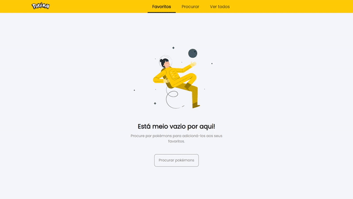

  

  

## 💻 Projeto

Projeto desenvolvido com HTML, CSS e JavaScript para o processo seletivo da Novadata.

## ✨ Linguagens

- HTML;
- CSS;
- Javascript;
- Biblioteca: axios.

## 🚧 Requisitos

✔ Filtrar:  
. Buscar apenas pelo nome. Caso busque por número, ele mostra a tela de "Nada encontrado".  
. Eu consegui deixar pesquisar por nome e número, mas não aparecia a tela de não encontrado, então preferi deixar assim para todas as telas serem exibidas. 
. Mesmo assim, buscar pelo número salva o pokémon na lista de favoritos.  
✔ Categorizar;  
✔ Favoritar:  
. Essa ação ocorre apenas ao clicar no botão de pesquisa. 